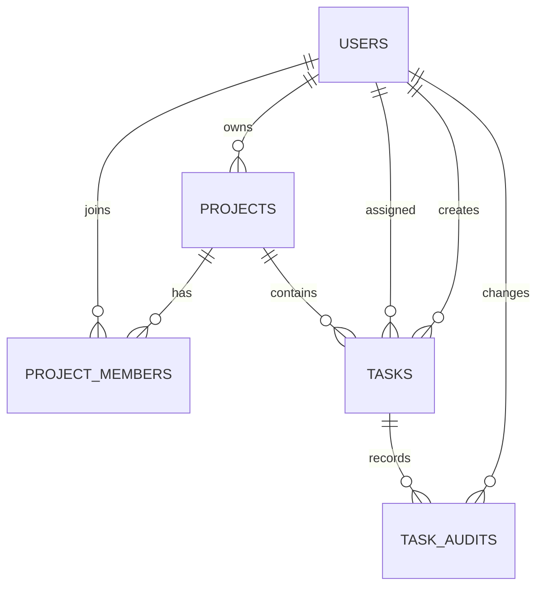

# Arquitetura e decisões técnicas

## Visão geral

A aplicação usa arquitetura em camadas, adequada ao tamanho do desafio e familiar para equipes Java:

```text
HTTP -> Controller -> Service -> Repository -> PostgreSQL
                      |             |
                  regras        persistência
```

```text
controller  contratos HTTP, status codes e validação de entrada
dto         modelos de entrada e saída
service     casos de uso, autorização e regras de negócio
repository  consultas e persistência
entity      modelo JPA e comportamento simples do domínio
mapper      conversão explícita entre entidades e DTOs
security    autenticação JWT e integração com Spring Security
config      infraestrutura transversal
exception   respostas ProblemDetail padronizadas
```

Uma arquitetura hexagonal completa foi considerada, mas aumentaria a quantidade de portas, adapters e interfaces sem ganho proporcional neste escopo. A arquitetura em camadas mantém separação clara sem over-engineering.

## Modelo de dados



O dono também é registrado em `project_members`. Isso permite que toda verificação de leitura de tarefas use uma regra única de pertencimento, enquanto `owner_id` mantém explícita a autoridade de administração.

## Segurança

O login usa email/senha com BCrypt e emite JWT assinado por HMAC. A API é stateless: não cria sessão HTTP. O filtro JWT restaura o usuário no `SecurityContext` a cada requisição.

A autorização é feita em duas camadas:

1. Spring Security protege a API e restringe criação de projetos a `ADMIN`.
2. Services validam pertencimento, propriedade do projeto e regras específicas.

Essa combinação evita depender apenas de regras declarativas no controller e protege o caso de uso caso ele seja chamado por outra entrada no futuro.

O cadastro público sempre cria `MEMBER`; permitir que o cliente escolha `ADMIN` seria escalada de privilégio.

## WIP e concorrência

Apenas contar tarefas antes da alteração permitiria uma corrida: duas requisições simultâneas poderiam observar quatro tarefas e ambas criar a quinta e a sexta.

Antes de mover uma tarefa para `IN_PROGRESS`, a aplicação adquire `PESSIMISTIC_WRITE` na linha do responsável e depois conta suas tarefas em andamento. Requisições concorrentes para o mesmo usuário são serializadas. O trade-off é reduzir paralelismo apenas nas transições WIP daquele responsável, uma região crítica pequena.

## Busca textual

A busca usa `LOWER(title) LIKE '%texto%'` e `LOWER(description) LIKE '%texto%'`, sempre limitada ao projeto e paginada. A migration cria índices `GIN` com `pg_trgm` sobre as mesmas expressões, permitindo que o PostgreSQL acelere buscas por fragmentos.

Em uma escala muito maior, seria avaliado PostgreSQL Full Text Search ou um mecanismo dedicado. Para o escopo, trigramas mantêm a solução simples e transacional.

## Filtros e ordenação

Uma implementação customizada com Criteria API monta somente os predicados informados. A prioridade possui ordenação semântica (`LOW < MEDIUM < HIGH < CRITICAL`), evitando a ordenação alfabética incorreta de um enum armazenado como texto.

O resultado retorna metadata de paginação e impõe tamanho máximo de 100 itens.

## Cache

Somente o relatório agregado é cacheado por projeto por cinco minutos. Listagens possuem muitas combinações de filtros e cacheá-las aumentaria cardinalidade e complexidade de invalidação.

Toda criação, edição, exclusão ou mudança de status invalida o resumo do projeto. A autorização acontece antes de chamar o serviço cacheado; assim, um cache hit nunca contorna a verificação de pertencimento.

## Auditoria

Alterações relevantes geram registros imutáveis com usuário, horário, campo, valor anterior e novo. A auditoria é explícita no service, deixando claro quais mudanças têm valor de negócio. O trade-off é exigir manutenção ao adicionar campos novos.

## Datas

- `Instant` para criação e atualização, persistido com timezone e tratado em UTC.
- `LocalDate` para deadline, pois o requisito representa um dia de prazo e não um instante exato.

## Frontend

TanStack Query controla estado remoto, cache de requisições e invalidações. Zustand armazena somente sessão/token e usuário, evitando duplicar dados de servidor em estado global. O board usa dnd-kit e mantém o backend como fonte da verdade; se uma transição falhar, a consulta é invalidada e o erro é exibido por toast.

## Integridade

Flyway é a única fonte de criação de schema e Hibernate usa `ddl-auto: validate`. Entidades não são expostas diretamente. `@Version` protege projetos e tarefas contra sobrescritas silenciosas por atualizações concorrentes.
